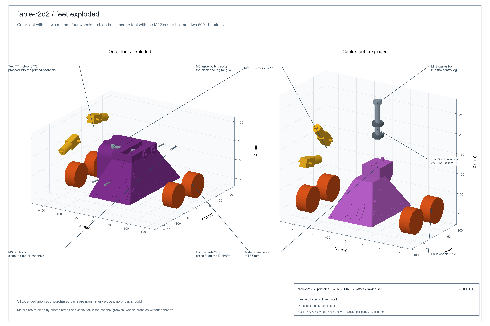
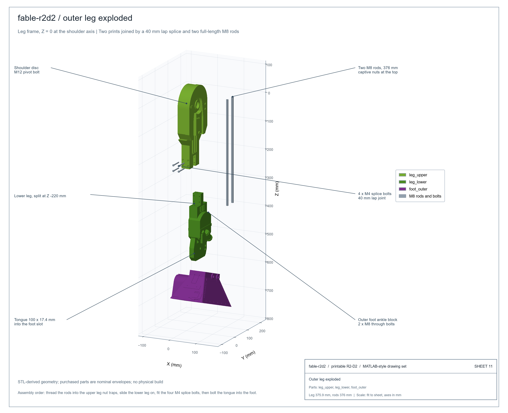
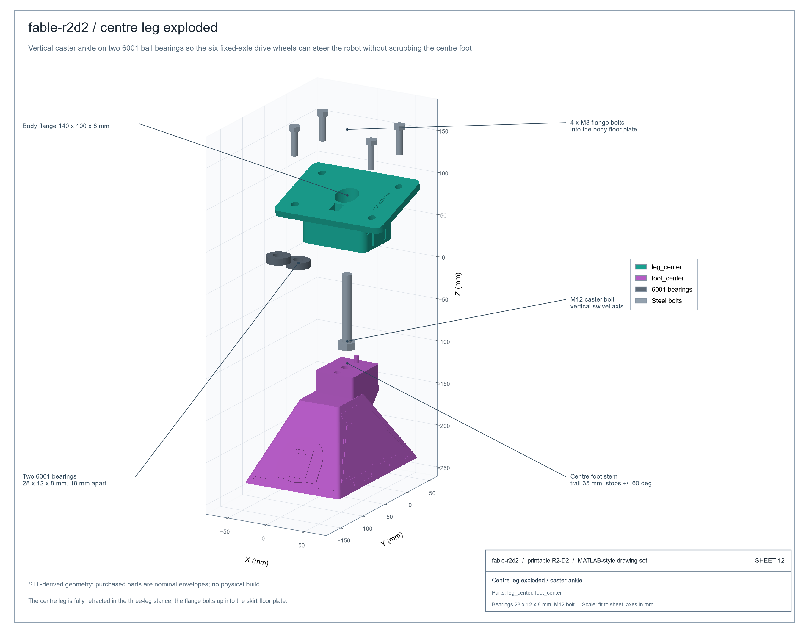
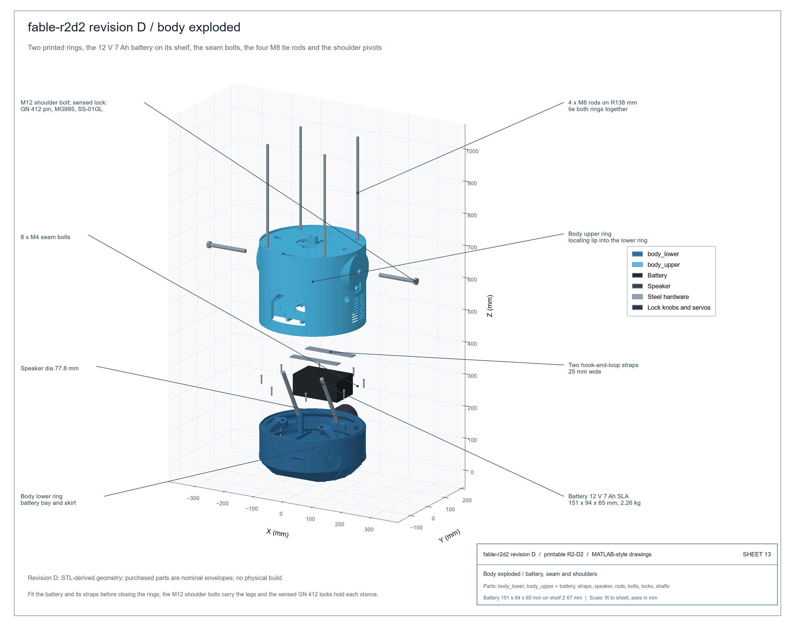
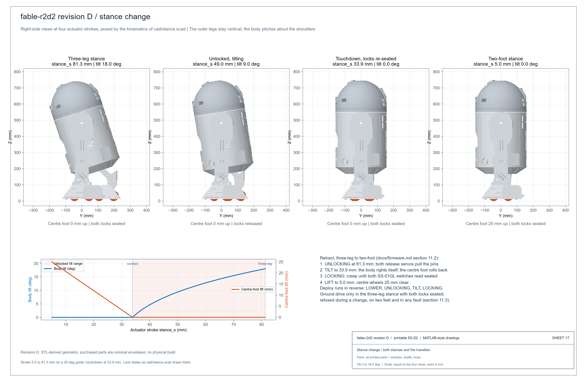
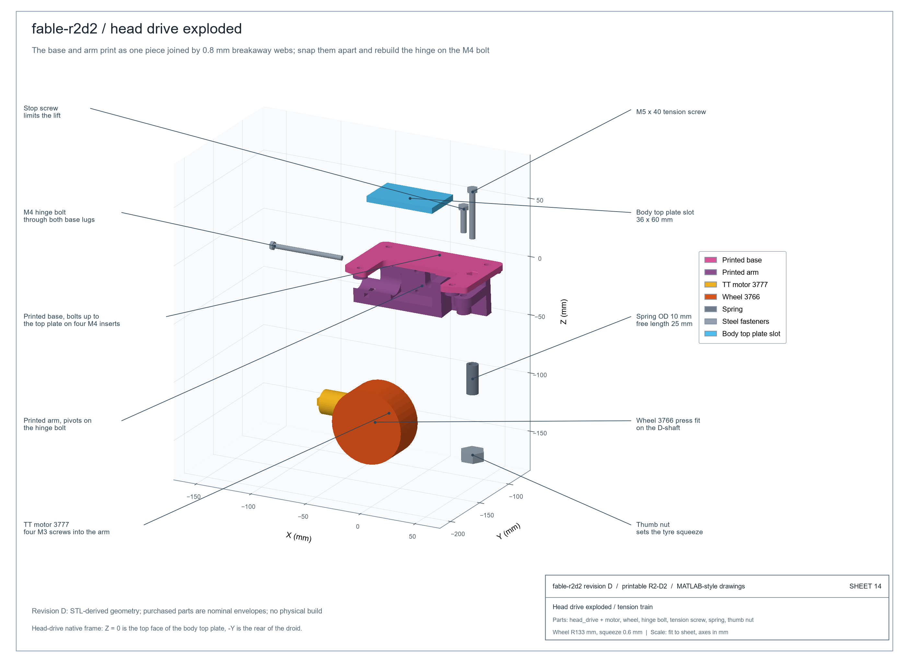
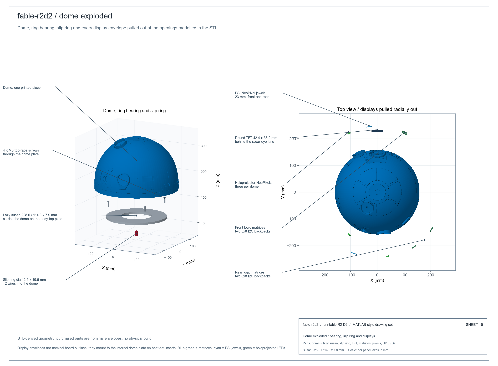
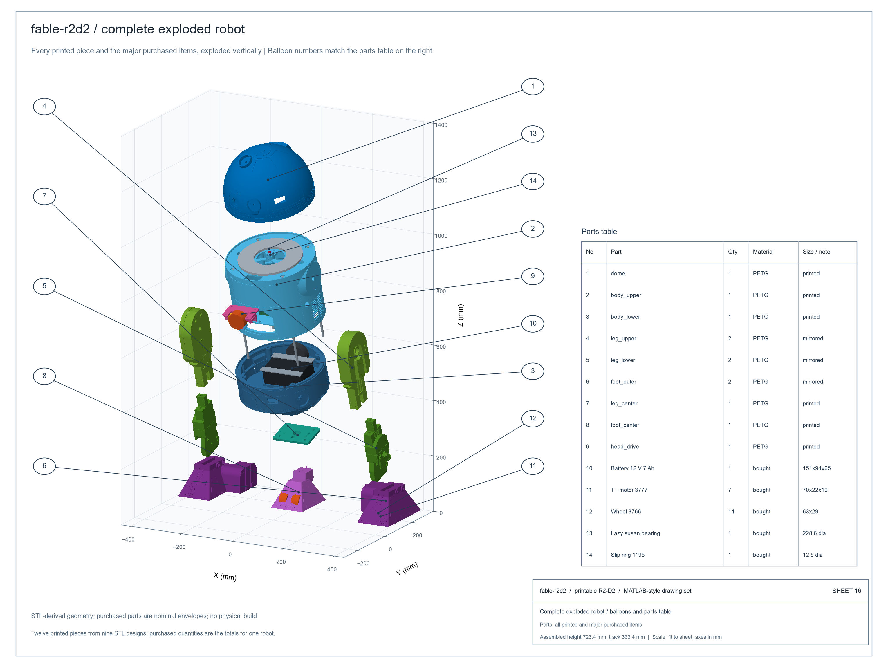

# fable-r2d2 assembly sequence

Revision D, written 2026-09-12. The stages run in order, and each one ends with a check you can
fail. Stages 4B and 5B build the revision D stance mechanism: the guide, the carriage, the
actuator and the sensed shoulder locks (docs/mechanical.md sections 1.3, 3.5 and 3.9).

Read [mechanical.md](mechanical.md) first. It has the print settings, the support notes, the
print order and every fit. This document does not repeat them.

The harness is built and checked separately, on the bench, before it goes in the body. That
procedure is [electrical.md](electrical.md) section 7, and it is not repeated here. The
software setup is [firmware.md](firmware.md) sections 5 and 6, and that is not repeated either.

**Nothing in this package has been built.** No torque below has been measured on hardware.
Torques marked "estimated" are design judgement, not test results.

---

## Tools

| Tool | Used for |
| --- | --- |
| Soldering iron with heat-set insert tips, M2 to M5 | Pressing 21 brass inserts |
| Hex keys 1.5, 2, 2.5, 3, 4 mm | M2 to M5 socket screws |
| Torque screwdriver, 0.3 to 3 N.m | M3, M4 and M5 fasteners |
| Torque wrench, 2 to 20 N.m | M8 and M12 fasteners |
| Sockets and spanners 5.5, 7, 8, 13, 19 mm | M3, M4, M5, M8 and M12 nuts |
| Deep 13 mm socket | M8 rod nuts in the 22 mm ankle counterbores |
| Hacksaw or threaded-rod cutter, and a flat file | Cutting and chamfering eight M8 rods |
| Drill with 6.0, 8.0 and 12.0 mm bits, and a round file | Clearing printed bores that came out tight |
| Sharp craft knife | Cutting the two head-drive sacrificial webs |
| Digital calipers | Checking every bore before pressing anything into it |
| Paint pen or fine marker | Marking wheel axial positions |
| Crimp tool, wire strippers, soldering iron | The harness, per electrical.md |
| Multimeter | The rail checks, per electrical.md section 8 |
| Kitchen scale | Weighing every print as it comes off the bed |
| Bathroom scale | The centre-foot load test |
| Spring scale, 0 to 20 N and 0 to 50 N | Pull, yaw and dome rim tests |
| Dial indicator | Motor shaft play, before and after |
| IR thermometer | Motor case temperature |
| Tilt board and protractor, or a phone inclinometer | The tip-back test |
| Hacksaw with a fine blade, flat file, deburring tool | Cutting and chamfering the two 12 mm guide shafts |
| Bench power supply, 12 V, current limit 1 A | Stroking the P16 actuator off the robot |
| Continuity tester or multimeter | Reading each SS-01GL lock switch as its pin seats |
| Drill with a 3 mm bit | The tip-pin hole in each MG995 horn |

## Consumables

| Item | Quantity | Note |
| --- | --- | --- |
| Bambu PETG Basic 1 kg | 6 spools | About 8 kg of printed mass is predicted; buy six |
| Bambu PLA Basic 1 kg | 1 spool, optional | Dome only |
| Threaded rod M8 x 1.25, 1 m | 4 | Cut plan in stage 2 and stage 7 |
| Cable ties, 4.8 mm | 8 | Two per foot, in the printed saddle grooves |
| Cable ties, 3.6 mm | 2 | Head-drive motor can, plus one spare |
| Cable ties, 8 inch | 100 pack | Harness bundling and slip-ring strain relief |
| Adhesive cable-tie mounts, 3/4 inch | 100 pack | Harness routing inside the rings and legs |
| Closed-cell foam tape, 3/4 x 3/8 inch | 1 roll | Under the battery, behind the speaker, round the dome plate |
| Medium-strength threadlocker | 1 bottle | Ankle bolts and the caster bolt (estimated need) |
| Isopropyl alcohol | 500 ml | Cleaning before paint and before gluing lenses |
| Acrylic cement or clear epoxy | 1 tube | Three lens discs |
| Filler primer, white, blue, silver paint | as needed | See mechanical.md section 7 |
| Light grease | 1 small tube | The two lock pins; the check assumes greased pins (mechanical.md section 3.9) |

The full purchased list with part numbers, prices and sources is `bom/hardware.csv` and
`bom/electronics.csv`.

---

## Insert pressing schedule

Press every insert before any painting and before any wiring. Pocket sizes come from
`cad/lib.scad` and are listed in mechanical.md section 4.2.

| Insert | Count | Part | Where exactly | Pocket |
| --- | --- | --- | --- | --- |
| M5 x 9.5 brass | 4 | `body_upper` top plate | Lazy-susan **bottom** race, radius 110.9 mm at 45, 135, 225, 315 degrees | 6.4 mm x 9.5 mm |
| M5 x 9.5 brass | 4 | `dome` plate | Lazy-susan **top** race, same radius and angles, pressed from **below** into 12 mm tall bosses | 6.4 mm x 9.5 mm |
| M5 x 9.5 brass | 1 | `head_drive` arm | Lift-stop boss, faces up in the print | 6.4 mm x 9.5 mm |
| M4 x 8.1 brass | 4 | `head_drive` base | Mating face, in the 12 mm x 3 mm pads at (+/-45, -84) and (+/-42, -139) | 5.6 mm x 8 mm |
| M2.5 brass | 2 | `dome` radar eye housing | Inner face beside the TFT pocket, 54.4 mm apart, for the retaining strap | 3.7 mm x 5 mm (estimated) |
| M2 brass | 6 | `dome` | Two per logic-display block: lower front, upper front, rear. Inner faces, for the backpack straps | 3.2 mm x 4 mm |
| M3 brass | 4 | `body_upper` | Rear access cover, in the 10 mm lip round the 120 x 90 mm opening | 4.0 mm x 6 mm |
| M2.5 brass | 4 | `body_upper` deck | Raspberry Pi 4 bosses, on the `pi4_holes` pattern | 3.7 mm x 5.2 mm |
| M2.5 brass | 2 | `body_upper` deck | ADS1115 bosses | 3.7 mm x 4.0 mm |
| M2 brass | 10 | `body_upper` deck | KB2040 (2) and the four DRV8833 boards (2 each) | 3.2 mm x 4.0 mm |
| M4 x 8.1 brass | 4 | `body_upper` shoulder pads | Two behind each GN 412 lock flange pocket (`bom/hardware.csv` H22) | 5.6 mm x 8 mm |
| M4 x 8.1 brass | 2 | `body_lower` top shaft bosses | One per guide-shaft set screw (H22, H43) | 5.6 mm x 8 mm |
| M3 brass | 8 | `body_upper` lock blocks | Four per MG995 release servo, behind the ears (H24) | 4.0 mm x 6 mm |

That is 55 inserts: 9 x M5, 10 x M4, 12 x M3, 8 x M2.5 and 16 x M2. Press each one square, with
the iron set to about 250 C for PETG, and stop when the insert face is flush. An insert pressed
at an angle cannot be straightened.

**No inserts go in the feet, the legs, the centre-leg housing or the carriage, and
`body_lower` takes only the two set-screw inserts.** Those parts use through-bolts with
captive nuts in printed pockets. This is deliberate: a nut in a pocket does not pull out of a
printed part under preload the way an insert can. It is also why the four M8 body rods and the
two pitch-hinge bolts land in hex pockets, not inserts.

---

## Stage 1 — feet, motors and wheels

Six Adafruit 3777 motors and twelve Adafruit 3766 wheels go in here. Two motors and four
wheels per foot. **Do this stage on one outer foot first, before printing anything else**
(mechanical.md section 6).

*Figure 10 — outer foot exploded: shell, two TT motors, four wheels, tab bolts, cable ties.*

1. **Centre foot only, and first:** slide the M12 hex nut into its slot under the top plate,
   entering from the +X side. The slot is 19.4 mm across flats and 8.4 mm deep. Once the
   motors are in you cannot reach it. Turn the foot upright and check the nut stays put.
2. **Check every motor pocket with calipers** before pushing a motor in. Each pocket is the
   motor envelope plus 0.4 mm (`motor_pocket_clear`). Clear any support residue.
3. **Push each motor up into its pocket from the open sole.** Every pocket is a vertical
   drop-in channel, so the motor and its wheels go in as one unit from below. The gearbox top
   face must land flat on the tilted pocket ceiling. That face contact is what carries the
   wheel load.
   - **Outer feet:** both cans point outward and sit 13 degrees below horizontal.
   - **Centre foot:** the front can points inward and **up 45 degrees**; the rear can points
     inward and 10 degrees below horizontal.
4. **Outer feet only:** fit the two M3 x 35 tab bolts, one per motor, across the end-block
   channel. The head goes on the -X cheek and the nut drops into the slot in the +X cheek.
   Tighten to **0.6 N.m (estimated)**. These pin the motor's rear tab.
5. **Cable-tie each can** in its saddle groove with a 4.8 mm tie. Two ties per foot. The tie
   holds the motor when the foot is lifted; the pocket ceiling holds it when the foot is down.
6. **Press the four wheels on.** Two per motor, at 23.8 mm each side of the motor centre plane
   (`wheel_x`). Press the hub down until it is within 1 mm of the gearbox face. Support the
   gearbox, not the shaft, while pressing. **Mark the hub position on the shaft with a paint
   pen** — this mark is what the one-hour wear test in stage 11 reads.
7. **Splice the motor leads.** The stock 28 AWG leads are short. Splice each to 22 AWG inside
   the foot, per electrical.md section 7 step 8, and crimp a JST-XH pair on the far end. Route
   through the 8 mm wire hole in the top plate: on the outer foot at (X 20, Y -38), on the
   centre foot per the note in stage 3. Both motors reach it through the 8 mm pass in the
   centre rib.
8. **Check:** every wheel turns freely in its 3 mm cavity and nothing rubs the shell. Spin each
   motor by hand from the wheel. Both motors in a foot should feel the same.

Repeat for the second outer foot and the centre foot.

## Stage 2 — outer legs

Two legs. Each is `leg_upper` plus `leg_lower`, spliced and rodded, then bolted to its foot.

*Figure 11 — outer leg exploded: upper, lower, comb joint, four M4 x 80, two M8 rods, ankle
bolts.*

1. **Cut four M8 rods to 390 mm.** The leg bore runs from z -336 to z +55, which is 391 mm.
   `cad/legs.scad` names M8 x 400 stock, so cut 10 mm off each. **File a chamfer on both ends
   of every rod** or it will not start in the captive nut. Two 1 m rods give all four leg rods
   with a 220 mm offcut.
   *(`bom/hardware.csv` H09 plans 425 mm cuts. That does not fit the bore. Use 390 mm.)*
2. **Load the captive top nuts.** Each `leg_upper` has two hex nut traps that open on the
   inboard face at z 40 to 48.4 mm. Slide an M8 nut into each from the inboard face. Check it
   sits square and cannot rotate.
3. **Dry-fit the comb joint.** The tongue on `leg_lower` is 20 mm wide and 40 mm tall and goes
   into the slot between the two fingers on `leg_upper`. Clearance is 0.2 mm each side. If it
   is tight, file the tongue, never the fingers — the fingers carry the rod bores.
4. **Fit the four M4 x 80 splice bolts.** They pass through the whole strut width, front to
   rear, at x = 5 and 25.4 mm, z = -210 and -190 mm. Heads go in the 8 mm counterbores on the
   **front** face; M4 nuts go in the pockets on the **rear** face. Add an M4 washer under each
   head and nut. Torque to **1.5 N.m (estimated)**.
5. **Feed the two M8 rods in from the ankle end.** Push each rod up through `leg_lower`, across
   the splice, into `leg_upper`, and thread it into the captive nut at the top. Turn the rod,
   not the leg.
6. **Tighten the rods.** At the ankle underside, fit an M8 fender washer (24 mm) and an M8 nut
   in each 22 mm counterbore. Use a deep 13 mm socket. Torque each to **1.6 N.m**, which is
   about 1 kN of preload (`research/loads.md` section 7). Work them up in two passes so the
   splice closes evenly.
7. **Check the splice:** no visible gap at the joint line, and the leg does not flex at the
   splice when you twist the two halves against each other by hand.
8. **Bolt the leg to its foot.** Drop the tongue into the foot slot. Line up the pivot bore at
   6.3 mm above the shell top and push the **M8 x 80 pivot bolt** through both block cheeks and
   the tongue, head outboard. The nut sits in the pocket in the inboard boss. Run it down until
   the play is gone **but the tongue still swings by hand.** Do not torque it.
9. **Stand the leg vertical with the lock bolt.** The tongue's two lock holes lie on the same
   40 mm arc about the pivot as the foot's single lock bore. Stand the leg straight up and fit
   the **M8 x 90** lock bolt through the foot's lock bore into tongue hole **A** at (y +40, z 0).
   Revision D keeps the outer legs vertical in both stances (`leg_lean` = 0, mechanical.md
   section 1.3), so hole **B**, the revision C 18 degree lean, is not used. Add threadlocker.
   Tighten until firm, **about 6 N.m (estimated)**; this bolt takes the ankle moment.
10. **Pull the motor leads up the leg.** The wire route enters the ankle underside at (35, -38),
    runs diagonally into the strut centre, up the 9 mm bore, and exits the inboard face at
    z -75, which is below the shoulder pad. Leave 300 mm of slack at the top.
11. **Check:** the finished leg and foot weigh about 2.8 kg. The ankle has no play. The leg is
    straight when sighted down the strut.

Repeat, mirrored, for the second leg.

## Stage 3 — centre-leg housing and caster

*Figure 12 — centre leg exploded: housing, carriage, two LM12LUU bearings, pitch hinge, two
6001-2RS bearings, M12 caster bolt, centre foot.*

1. **Check both bearing seats with calipers.** They are 28.2 mm (`caster_bearing_od` plus
   0.2 mm). The lower seat opens to the bottom face at z 26 to 34.2 mm; the upper opens into
   the 28 mm head counterbore. Centres are 18 mm apart (`caster_bearing_gap`).
2. **Press in the two 6001-2RS bearings**, 12 x 28 x 8 mm. Press on the **outer** race only.
   Each must sit flat on its ledge.
3. **Fit the 9.8 mm spacer tube** (12 mm ID) between the two inner races. This is what stops
   the M12 preload crushing the bearings.
4. **Fit the 6 x 8 mm swivel-stop pin** in the centre foot's stem-block top, at
   (X 0, Y `caster_trail` + 22), which is 22 mm ahead of the caster axis. That is the radius
   of the leg's arc groove (`ft_stop_r` = `lg_stop_r` = 22), and it lands on solid stem-block
   material.
5. **Set the housing on the foot** and drop the **M12 x 70 hex bolt** down from above: head into the
   28 mm counterbore, washer, upper bearing, spacer tube, lower bearing, washer, 1 mm thrust
   washer, into the M12 nut already captive in the foot.
6. **Tighten the M12 from above, now.** Once the carriage is hinged on (stage 4B) it is hard to reach.
   Tighten until the spacer tube is solidly clamped, **about 8 N.m (estimated)**. Add
   threadlocker.
7. **Check the swivel:** the foot must turn freely and stop at 30 degrees each way against the
   pin (`caster_stop_deg`). If the caster is stiff, the spacer tube is too short or a bearing is
   not square.
8. **Route the centre-foot motor leads** up through the foot's 8 mm wire hole at
   (X 0, Y `caster_trail` - 21) = (0, -1), into the arc slot in the housing's bottom face
   (radius 16.5 to 22.5 mm) and up its vertical wire channel. The hole sits on the slot at
   **every** swivel angle. Leave 400 mm of slack: this bundle must survive 60 degrees of swivel
   and the full actuator stroke. It is dressed along the carriage in stage 4B.

## Stage 4 — lower body ring

*Figure 13 — body exploded: lower ring, upper ring, seam lip, eight M4, four M8 rods, battery,
guide shafts, shoulder locks.*

Work with the ring on the bench, skirt down.

**Order matters here.** The four M8 rod nuts are reached from inside, and the battery shelf
covers part of the floor. Do steps 1 to 3 before the battery goes in.

1. **Load the four captive M8 rod nuts.** Each rod column starts on the **battery shelf**, not
   on the floor: radius 138 mm lies outside the skirt-bottom plate, whose maximum radius is
   116.6 mm. The nut is a hex trap at **z 46**, opened downward with a slot facing the body
   axis. Slide an M8 nut into each of the four traps and check it cannot rotate.
2. **Check the carriage sweep is clear.** Revision D does not bolt the centre leg to the floor.
   The floor and the battery shelf are cut by the swept envelope of the carriage and the housing
   with 2 mm clearance (mechanical.md section 3.5). Remove every support string from that cut and
   from the two shaft bosses; a string left there will jam the carriage.
3. **Check both shaft bosses with calipers.** The bottom boss is blind and the top boss is open;
   both take the 12 mm shaft on the guide line. Clear a tight bore with a 12 mm drill turned by
   hand, never under power.
4. **Line the battery shelf with foam tape**, inside the printed curb. The shelf is a 4 mm
   plate whose top is at `battery_shelf_z` (mechanical.md section 3.5) and its curb stands 8 mm
   proud, 3 mm clear of the battery all round.
5. **Lay the battery on its side** inside the curb: 151 mm along X, 94 mm along Y, 65 mm tall.
   The pocket centre is at `battery_y`, forward of the body axis and clear of the sloping
   carriage face, which is deliberate — see mechanical.md sections 3.5 and 5.4. Terminals must face where the harness reaches
   them and must not touch a rod column.
6. **Strap the battery down** with two 25 mm hook-and-loop cinch straps, threaded through the
   four 3 mm strap slots in the shelf and cinched across the top. One strap does not reach
   round the battery on its own. The straps and the curb are the only things holding 2.26 kg
   when the robot is tipped.
7. **Fit F1 within 100 mm of the battery's positive terminal.** This is not optional. A 12 V
   7 Ah SLA delivers roughly 457 A into a short.
8. **Fit the speaker** behind the front pocket vent door, which is a grille of **nine 5 mm
   vertical louvres**. The speaker is 77.8 mm in diameter and 25.5 mm deep and lands on the
   printed bosses behind the door. Use foam tape round the rim so it does not buzz.
9. **Fit the charge port and the switch** on the rear lower band pad: the Switchcraft L722A
   panel jack (5.5 x 2.1 mm, centre positive) and the Carling rocker in its 36.83 x 21.08 mm
   cutout. The charge branch joins the **battery** side of the switch, so the charger works
   with the robot off. Wiring is electrical.md sections 1 and 5.
10. **Stand the four M8 body rods** in the captive nuts from step 1, at radius 138 mm, at 45,
    135, 225 and 315 degrees. Cut them to **385 mm** each. Two 1 m rods give all four with a
    230 mm offcut. Chamfer both ends. Thread each a few turns into its nut and leave it loose:
    all the tightening happens at the top plate in stage 7.
11. **Check:** the battery does not move when the ring is tipped 45 degrees in any direction.
    All four rods stand parallel and clear the shelf, the curb and the skin.

## Stage 4B — stance guide, carriage and actuator

Revision D. The centre leg rides a printed carriage on two guide shafts inside `body_lower`, and
an Actuonix P16 actuator moves it (mechanical.md sections 3.5 and 3.9). Do this stage with the
lower ring on the bench, skirt down, before the upper ring goes on.

*Figure 17 — stance change: the three-leg stance, an unlocked tilt, touchdown and the two-foot
stance, with body tilt and centre-foot lift against actuator stroke.*

1. **Lay out the parts.** Two 12 mm hardened guide shafts (`bom/hardware.csv` H40), two LM12LUU
   bearings (H38), the printed `leg_carriage`, two 8 x 12 x 12 mm bronze sleeves (H37), two
   M8 x 35 hinge bolts with M8 washers (H36, H12), four M4 x 25 clamp screws with nuts (H39, H20),
   two M4 x 8 cup-point set screws (H43), one M4 x 45 rod-eye pin with an M4 nyloc (H42, H45), and
   the actuator ACT1 (`bom/electronics.csv`).
2. **Cut the two guide shafts** to **182 mm** each from the 200 mm stock (`bom/hardware.csv` H40,
   mechanical.md section 3.5): 147 mm of bearing-housing travel, 9 mm in the bottom boss, 24 mm in
   the top boss and 2 mm of clearance. Check the length against your printed `body_lower` before
   cutting. Deburr and chamfer both ends.
3. **Fit the bearings to the carriage.** Push each LM12LUU into its seat until it sits on the
   bottom lip. Fit two M4 x 25 screws across each clamp slit, with the nut in its printed pocket.
   Snug them until the bearing cannot turn in the seat. Do not crush the housing.
4. **Hinge the carriage to the housing.** Slide a bronze sleeve into each carriage cheek. Straddle
   the `leg_center` housing with the cheeks and fit an M8 x 35 bolt, with an M8 washer under the
   head, through each sleeve into the captive M8 nut in the housing. Tighten until the sleeve is
   clamped. The cheek must still turn on the sleeve by hand: the sleeve stands 0.5 mm proud to
   give that running clearance.
5. **Check the pitch stops.** Rock the housing on the hinge. It must stop on its heel face with the
   foot level under the stowed carriage, and on its toe face at `st_toe_stop` (19.5 degrees)
   relative to the carriage. Nothing else may touch.
6. **Install the carriage.** Lower the carriage, with the housing and the centre foot hanging from
   it, into `body_lower` so the two bearings line up with the shaft bosses on the 30 degree guide
   (`st_guide_angle`). Push each shaft down through its top boss and both bearings into the blind
   bottom boss. Drive the M4 set screw into the top-boss insert against the shaft, snug.
7. **Check the slide.** With the actuator not yet fitted, the carriage must run the whole guide
   by hand with no tight spot. At the bottom, the bearing housings land on the bottom shaft bosses:
   that is the hard stop at 86 mm of stroke. No part of the carriage, the housing or the foot may
   touch the floor plate or the battery shelf anywhere on the travel.
8. **Close the actuator.** On the bench, run the P16 fully closed from a 12 V supply limited to
   1 A on its red and black leads (swap them if it extends). Leave the pot leads free.
9. **Pin the rod eye.** Hold the rod eye in the slot of the carriage cross-web and fit the M4 x 45
   pin with its head in the -X counterbore and the M4 nyloc in the +X pocket. Snug only: the eye
   must pivot. The fixed eye is pinned to the deck cheeks in stage 7, when the upper ring goes on.
10. **Dress the harness.** Tie the centre-foot motor bundle and the actuator's five-wire lead along
    the carriage with slack for the full stroke, and lead both to the rear harness gap.
11. **Check:** the carriage slides freely end to end, the housing pitches between its two stops,
    and neither bundle pulls tight anywhere on the travel.

## Stage 5 — upper body ring, shoulders and legs

The legs go on the upper ring while it is still separate and open at both ends. Every shoulder
fastener is reachable from inside. **Do not do this after the rings are joined.**

1. **Press the inserts** listed in the schedule: four M5 into the top plate from **above**, for
   the lazy-susan bottom race; four M3 into the rear access lip; four M4 behind the two lock
   flange pockets; eight M3 in the two lock blocks; and the deck inserts (four M2.5 for the Pi,
   two M2.5 for the ADS1115, ten M2 for the KB2040 and the four drivers).
2. **Fit a steel crush sleeve** through each 30 mm shoulder boss. `research/loads.md` section 7
   is explicit: do not clamp printed faces with a torqued M12. The sleeve makes the clamp
   steel to steel.
3. **Fit the two flanged bronze bushings** (12 mm bore, 16 mm OD, 20 mm long, 20 mm flange)
   into the leg hub bore, one from each side.
4. **Build both shoulder locks now, stage 5B.** The lock flange screws go in from the leg side,
   so each lock must be complete before its leg is offered up.
5. **Support the leg.** With its foot it weighs about 2.8 kg and it will fall.
6. **Offer the leg up to the pad** with the 8 mm spacer stack (bushing flange plus washer)
   between the flat pad and the flat inboard face of the leg plate. Pull the lock knob as the leg
   goes on so the pin does not drag across the leg face.
7. **Fit the M12 x 130 class 8.8 bolt** from the leg side. The head goes into the 26 mm
   counterbore in the leg hub, 10 mm deep. Add M12 fender washers (37 mm) under the head and
   the nut. The M12 nyloc drops into its hex pocket inside the ring, 13 mm deep.
8. **Torque to 5 N.m.** That is about 2.1 kN of preload and about 1.9 MPa of face pressure. Do
   not go higher: a smaller washer or more torque makes the PETG creep.
9. **Seat the lock in the tilt-0 receiver.** With the ring upright on the bench and the leg
   hanging straight down, the leg's 261 degree receiver lines up with the pin. Swing the leg
   gently until the pin drops fully home. The spring does the work; never tap the knob.
10. **Check:** with the pin seated the leg cannot swing, and the SS-01GL reads closed between COM
    and NO. With the knob held pulled, the switch reads open and the leg turns with firm hand
    pressure against the 5 N.m clamp. If the pin will not enter, the receiver is not square: back
    it out and run it in again.
11. Repeat for the second leg.
12. **Pull both leg wire bundles** in through the shoulder area and up into the ring, with the two
    servo leads and the two lock-switch leads.

## Stage 5B — sensed shoulder locks

Revision D. One lock per shoulder: a spring plunger in the body pad, two receivers in the leg,
an SS-01GL switch that reads the pin and an MG995 servo that pulls it (mechanical.md section 3.9,
electrical.md section 11). Build both locks with the legs off.

1. **Parts per shoulder.** One J.W. Winco GN 412-6-35-B-1 plunger (`bom/hardware.csv` H34), two
   GN 412.2-M12X1.5-B6.2 receivers (H35), two M4 x 16 socket cap screws (H41), one Omron SS-01GL
   switch (SW2 or SW3), one MG995 servo (SV1 or SV2) with four M3 x 10 ear screws and one more
   M3 x 10 as the horn tip pin (H23).
2. **Receivers into the leg.** Screw two receivers into the inboard face of each `leg_upper`, at
   50 mm radius, at 261 and 279 degrees (`st_lock_r`, `st_lock_angle`), into the 11.0 mm
   thread-forming bores until the 13 mm hex seats in its pocket. Start each one square by hand;
   a crooked receiver will not take the pin. Their retention in PETG is not tested.
3. **Plunger into the pad.** From outside the ring, set the GN 412 flange into its pocket in the
   shoulder-pad land boss: it sits 5 mm deep and stands 7 mm proud. Fit the two M4 x 16 screws
   through the flange counterbores into the M4 inserts. Grease the pin lightly.
4. **Check the pin face.** With the pin fully forward, its face must sit 1 mm inside the leg face
   plane (`st_land_gap`), so the pin engages the receiver by 5 mm.
5. **Fit the SS-01GL** in its pocket in the lock block, lever under the knob, with two M2 screws.
   With the pin seated, the lever is pressed 0.9 +/- 0.2 mm past its operating point
   (`st_switch_ot`). A closed switch then guarantees at least 3.1 mm of pin in the receiver.
6. **Drill the servo horn** 3 mm at the arm position in `st_horn_arm` (12.5 mm across and 22.5 mm
   up from the spline centre) and fit the M3 x 10 tip pin.
7. **Fit the MG995** in its pocket with the four M3 x 10 ear screws into the inserts, driving them
   through the access bores in the -Y face of the block. Park the servo at its engage pulse
   (`ENGAGE_US`, docs/firmware.md section 11.4) before the horn goes on, then fit the horn with
   the tip pin 1 mm below the knob rim (`st_horn_rest_gap`).
8. **Wire it.** Lead the servo cable to its J13 extension and the switch COM, NO and NC wires to
   the KB2040 per electrical.md section 11: the left lock SW2 to SCK and MISO, the right lock SW3
   through J14 to GP12 and GP13.
9. **Check:** pull the knob 5.8 mm by hand and the switch opens; let go and the spring returns the
   pin and the switch closes. The release pulse is calibrated in stage 10; it must pull the pin
   5.8 mm without the servo stalling.

## Stage 6 — electronics deck

The deck is integral to `body_upper`: a 4 mm annulus at local z 36 to 40, from radius 50 to
154.9 mm, cut off by a chord at y = -114.9 that leaves a **40 mm harness gap** at the rear.
Build the whole harness on the bench first, in the order in electrical.md section 7. Do not
connect the battery yet.

Each board has its own printed seat, and each seat is labelled in the print.

| Seat | Label | Fixing |
| --- | --- | --- |
| Raspberry Pi 4 | `PI4` | Four M2.5 boss inserts on the `pi4_holes` pattern |
| KB2040 | `KB2040` | Two M2 boss inserts |
| Four DRV8833 | `DRV8833` | A 26 x 18 mm pad each, two M2 boss inserts each |
| Three regulators | `5V / 12V` | A 25.4 x 25.4 mm pad each with four 2.2 mm holes |
| ADS1115 | `ADC` | Two M2.5 boss inserts |
| Fuse holders | `FUSE` | One 46 x 20 mm seat |

1. **Fit TB2, the star ground stud, first.** Every return in the robot lands there and nowhere
   else.
2. **Mount each board on its own seat**, using the inserts above. Use M3 nylon standoffs only
   for the PAM8302 amplifier, which has no printed seat.
3. **Route the 12 V bus, the regulator outputs and the signal harness** per electrical.md
   section 7 and `electronics/wiring.csv`. Label both ends of every signal wire. The deck has
   **eight 6 x 2.5 mm cable slots** through it; use them rather than running wire round the
   deck edge.
4. **Bring the seven motor pairs up** through the 40 mm rear harness gap: two from each outer
   leg, two from the centre leg, and the head-drive pair. Land each at its driver output on a
   JST-XH pair. Bring the actuator lead, both servo extensions and both lock-switch leads up
   the same way.
5. **Cable-tie everything to adhesive mounts** on the inside of the ring. Keep the harness out
   of the head-drive keep-out: |x| up to 66 mm, y -160 to -70 mm, body-frame z 160 to 378 mm.
   A cable tie in that space will be cut by the friction wheel.
6. **Fit no fuses yet.** They go in during the rail checks in stage 10.
7. **Mount the stance boards:** U10 (DRV8871 actuator driver) with R5 fitted in place of its
   factory current-limit resistor, U11 (BSS138 level shifter) and fuse holder FH7 for F7, per
   electrical.md section 11. Leave F7 out.
8. **The rear access opening** (120 x 90 mm, body-frame z 165.1 to 255.1) is how you reach this
   deck once the robot is together. Leave its cover off until stage 10 is finished, then fit it
   with four M3 screws into the lip inserts.

## Stage 7 — join the two rings

1. **Check the seam lip is clean.** It is at radius 151.6 to 154.6 mm on the lower ring, 6 mm
   tall, with a 15 degree lead-in chamfer on its top outer edge. The socket in the upper ring
   is radius 151.3 to 154.9, so there is 0.3 mm of clearance each side. Do not sand it.
2. **Lower the upper ring onto the lower ring**, feeding the four M8 rods through the upper
   ring's rod bosses and the actuator case up through the deck slot as it goes. Two people, or
   a strap. Watch the leg wire bundles.
3. **Seat the lip fully.** No gap anywhere round the joint line.
4. **Pin the actuator's fixed eye** between the two cheeks under the deck with the M4 x 60 pin
   (`bom/hardware.csv` H44) and an M4 nyloc (H45). Snug only: the eye must pivot. The actuator
   is parallel to the guide, so it carries no side load.
5. **Fit the eight M4 x 20 socket cap screws from above**, through both internal flanges on the
   radius 148.9 mm bolt circle at 22.5, 67.5, 112.5 and so on. The hex nut pockets open
   downward under the lower flange, so the nuts drop in and stay put. Add a washer under each
   head. Torque to **1.5 N.m (estimated)**, going round in a star pattern, twice.
6. **Fit the four M8 rod nuts at the top plate**, each in its 18 mm x 4 mm counterbore with a
   washer. Torque each to **1.6 N.m** (about 1 kN of preload). Work them in a cross pattern in
   two passes. These rods put the whole body in compression from the battery shelf to the top
   plate and carry the dome, the head drive and the shoulder reaction. Each nut then stands
   2.8 mm proud and clears the dome plate by 5.1 mm.
7. **Do this before the lazy susan goes on.** The bottom race covers the rod counterbores.
8. **Check:** the body is one column. Lift it by the top plate — nothing at the seam moves.
   Re-check the eight M4 after the rods are torqued; the rods will have pulled the seam tighter.

## Stage 8 — head drive

*Figure 14 — head-drive exploded: base, arm, motor, wheel, M5 tension bolt, spring, thumb nut,
lift stop.*

The order below is the order in the `cad/head_drive.scad` header. It exists because each screw
is only reachable at one point in the sequence.

1. **Cut the two sacrificial webs.** They are 0.8 mm thick, 6 mm long, at x = +/-15 mm, joining
   the arm's hinge-boss ridge to the base plate underside. Cut both with a knife and **file the
   stubs flush.** The arm needs 3 mm of clearance at the ridge.
2. **Remove the tree supports** from inside the motor pocket, under the side beam and under the
   boss-to-wall bridge.
3. **Press the four M4 inserts** into the base mating face and the **one M5 insert** into the
   arm's stop boss.
4. **Drop the M5 x 60 hex head into its pocket** on the base's mating face. It hangs head-up
   and the top plate captures the head. It must be a hex head (DIN 933): a socket cap head
   spins in the pocket.
5. **Hold the base under the body top plate** and fit the **four M4 x 12 countersunk screws**
   from the **top** face, into the inserts. Torque to **1.2 N.m (estimated)**. The two inner
   heads sit under the lazy-susan bottom race, so they must be flush.
6. **Fit the arm.** Slide its ear slot over the hanging M5. Push the **M4 x 70 socket head**
   through the base lugs and the arm boss from inside the open body ring. Washer each side,
   then the M4 nyloc. **Snug it only. Do not torque it.** The arm must swing freely.
7. **Drop the motor into the saddle.** Fit the **two M3 x 30 button heads from the wheel side**,
   with their nuts in the blind pocket and the top slot. **They must go in before the wheel is
   pressed on.** Torque to **0.6 N.m (estimated)**.
8. **Press the wheel on** and **cable-tie the can** through the tunnel with a 3.6 mm tie.
9. **Fit the tension stack** on the M5: 15 mm OD washer, compression spring (10 mm OD, 25 mm
   free, 1.0 mm wire), plain washer, M5 knurled thumb nut. Leave it loose.
10. **Screw the M5 x 20 lift stop fully home** in the arm boss. Its tip then stands 5 mm proud
    and limits the arm's lift to 1 mm above working. With the dome off, this is what stops the
    gearbox hitting the base.
11. **Leave the drive released.** Tensioning happens in stage 9, after the dome is on.
12. **Check:** the arm swings from the lift stop down to the 7 degree release without touching
    anything. The wheel comes up through the 36 x 60 mm slot and nothing else does.

**Release procedure**, for every time the dome comes off later: back the thumb nut off about
8 mm, which is 10 turns. The arm falls until the bolt shank meets the end of the ear slot at
7 degrees. The wheel top is then 4 mm below the dome plate. The nut stays on the bolt.

## Stage 9 — dome electronics and the lazy susan

*Figure 15 — dome exploded: dome, TFT, four matrix backpacks, two jewels, three holoprojector
pixels, lens discs, lazy susan, slip ring.*

Do all the dome soldering with the dome off the robot and the backpack address jumpers already
bridged (electrical.md section 7 step 9).

1. **Press the dome inserts:** four M5 from below into the plate bosses, two M2.5 in the radar
   eye housing, six M2 in the three logic-display blocks.
2. **Fit the round TFT** (Adafruit 6178, 42.4 x 36.2 x 5.4 mm, two mounting holes 22.8 mm
   apart). Its 55.7 mm diagonal will not pass the 52 mm lens seat, so **it loads from inside**,
   against the seat lip. Hold it with a strap across the two M2.5 bosses, 54.4 mm apart.
3. **Fit the four 8x8 matrix backpacks:** two in the front logic pockets (20.6 x 28.6 mm each,
   one shifted down and one shifted up so each 20 x 20 matrix centres in its window), and two
   side by side in the rear pocket (40.6 x 28.6 mm). Strap each block with the M2 screws.
   Addresses are 0x70, 0x71, 0x72 and 0x73 (electrical.md section 6).
4. **Fit the two NeoPixel Jewels** in the front and rear PSI pockets, 24 mm x 4.5 mm, on their
   3.3 mm floors, with the leads through the 3.2 mm wire holes.
5. **Fit the three holoprojector NeoPixels**, one per barrel, in the 8.4 x 6 mm pockets with the
   leads through the 8 x 3.5 mm slots.
6. **Glue the three acrylic lens discs** into their seats: radar eye 52.1 x 2 mm, front PSI
   29 x 1.5 mm, rear PSI 36 x 1.5 mm. Every seat has 0.5 mm of clearance. Use a thin bead and
   keep cement off the face.
7. **Wire the dome side of the slip ring.** Twelve rotor leads to the dome devices, per the
   table in electrical.md section 6. Pull the bundle through the cable notches in the plate
   inner edge and **anchor it with a zip tie through the wire-anchor lug** at radius 70 mm.
   The anchor is what stops a pull ever reaching a slip-ring lead.
8. **Fit the slip-ring body** in the hub at the centre of the top plate's three-spoke spider.
   The bore is 12.5 mm and is open top and bottom; an M3 pinch clamp closes it. Cable-tie
   **both** bundles within 40 mm of the ring.
9. **Fit the lazy-susan bottom race first.** Set the Triangle 9C on the body top plate,
   concentric, and drive four M5 x 12 screws down into the top-plate inserts. Torque to
   **2 N.m (estimated)**. Check the dome turns smoothly by hand on the race before the dome
   goes on.
10. **Lower the dome on.** Line its plate bosses up over the race's top plate.
11. **Drive the top-race screws up through the access holes.** There are **three** 12 mm access
    holes, at 0, 90 and 270 degrees; the top-race screw holes are at 45, 135, 225 and 315
    degrees. Rotate the dome to bring each screw hole over an access hole, then drive an
    M5 x 12 up into the dome-plate insert. **`cad/body.scad` omits the 180 degree access hole
    altogether**, because the head-drive base covers it. Three holes reach all four screws.
12. **Tension the head drive.** Turn the thumb nut **up** until the spring is compressed 4 to
    6 mm, which is a spring length of about 20 mm. That is 8 to 12 N at the ear and 4 to 6 N at
    the tyre. `research/loads.md` section 5 asks for 3 to 5 N.
13. **Check:** the dome turns by hand with light, even drag and no notch. The gap at the body
    top edge is even all the way round, about 1.9 mm. The dome does not lift off the race
    anywhere.

## Stage 10 — firmware and first power-on

Do the rail checks **before** the Pi, the drivers or the dome are connected. Follow
[electrical.md](electrical.md) section 8 step by step and do not skip step 1: a bridged fuse
holder on a pack that can deliver about 457 A into a short is how harnesses catch fire.

1. **Rail checks**, electrical.md section 8 steps 1 to 4. Fuses go in one at a time. Each step
   ends with the power off.
2. **Flash the KB2040**, [firmware.md](firmware.md) section 5.
3. **Set up the Raspberry Pi**, firmware.md section 6: buses and groups, code and
   dependencies, controller port, sound, the `R2-FABLE` access point, and the service.
4. **Connect the loads and boot**, electrical.md section 8 step 5. The Pi must boot and no rail
   may sag below its tolerance.
5. **Check the battery gauge** against a meter at the battery terminals, within 0.15 V
   (electrical.md section 8 step 6).
6. **Drive test with the wheels off the ground.** Put the robot on blocks. Send `E 1` then
   `M 300 0 0 0` on the KB2040's serial port. Only the left foot should turn, forward. If a
   motor turns the wrong way, swap its two leads at the driver output.
7. **Repeat for every motor**, one at a time, before any of them touch the floor. Seven motors:
   six drive and one head.
8. **Head drive:** run it at 50 percent PWM. The dome should turn at about 8 to 9 RPM. Below
   35 percent it stalls.
9. **Check the control page**, firmware.md section 7.
10. **Commission the stance change before any powered change**, firmware.md section 11.4, with
    the robot on blocks and the centre wheels clear of the floor: measure the pot endpoints, set
    `RELEASE_US` per side, check each SS-01GL at 3.3 V and 1 mA, time one creep through each
    receiver, and watch the centre-foot feed.
11. **First powered change, still on blocks.** Hold the stance control through one retract and
    one deploy. Every phase in firmware.md section 11.2 must be reported in order, and letting
    go of the control must stop the actuator and hold.

## Stage 11 — acceptance tests

These are the five ranked tests from `research/loads.md` section 8, plus the head-drive rim
test from section 5, a stopping check and the revision D stance-change test (11.9). Run them in this order. Each has a pass criterion,
and a failure is a real failure, not a note.

*Figure 16 — whole robot exploded: dome, two body rings, head drive, two legs, centre-leg
housing and carriage, three feet.*

### 11.1 Mass

Weigh the whole robot on the bathroom scale.

- **Expected:** **13.2 kg**, from the CAD screening in `docs/stability.json`
  (6,552.1 g printed plus 6,644.2 g purchased). The wider range from
  `research/loads.md` section 1 is 11.6 to 15.0 kg; revision D adds the actuator, the guide, the
  carriage and the locks.
- **Pass:** the reading is inside that range and the running total of printed masses matches
  the group budgets in mechanical.md section 5.1.
- **If over:** every extra kilogram cuts drive margin and runtime and raises turning scrub. The
  lightening options are in loads.md section 1.

### 11.2 Centre-foot load, on the bathroom scale

Stand the robot in the three-leg stance with the centre foot on the bathroom scale and the two
outer feet on packers of the same height.

- **Pass:** the centre foot carries **at least 28 percent of total mass**.
- **Expected:** `docs/stability.json` puts the three-leg centre of gravity at y
  44.2 mm, between the outer-foot axle line at y 0.0 mm and
  the centre-foot axle line at y 152.1 mm, and gives a static share of
  **0.29** on the two-line model.
- **If the outer feet read near zero:** the centre of gravity must move before the robot
  drives. Differential drive needs load on the outer wheels.
- **Note:** revision D puts the centre foot ahead of the outer feet, as `research/loads.md`
  assumed. This test is the first real measurement of that share.

### 11.3 Tilt test

Put the robot on a tilt board and raise the front until the centre foot lifts.

- **Pass:** the robot reaches **15 degrees or more** of backward tilt before the centre foot
  lifts.
- **Expected:** `docs/stability.json` gives a three-leg tip-back margin of
  **89.2 mm** and an angle of **15.6 degrees**, against the 15 degree
  criterion. Tip-forward is 25.5 degrees and side tip 32.7 degrees. The
  two-foot support margin is 34.5 mm (6.2 degrees): the two-foot stance is
  for standing still, never for a tilt board.
- **If under:** the centre of gravity must move forward. The remaining moves, in order of
  effect, are: move the battery forward on its shelf (`battery_y`), lower the shoulder axis in
  the body, and move the deck load forward. Re-run 11.2 after any change.
- **Do not skip to 11.4 on a failure.**

### 11.4 Traction and turning

1. **Pull test.** Tow the robot on the target floor with a spring scale, at a constant slow
   speed, motors unpowered. **Expected 2.6 to 5.2 N.**
2. **Push test.** Measure the force the powered robot delivers against the scale. **Expected
   4.7 N per side at the 1 A driver limit.**
3. **Arc turn.** Command a 0.5 m radius arc at 50 percent PWM. **Pass: it completes without a
   stall.** This is the test that retires the number one risk.
4. **Back-drive check.** Push the robot with the motors unpowered. The gearboxes must
   back-drive, or a stalled motor drags.

### 11.5 Twenty-minute drive, current and temperature

Drive for 20 minutes continuously on the worst floor in the house.

| Measure | Pass |
| --- | --- |
| Motor case temperature, IR thermometer | **Below 70 C** |
| Battery voltage after one hour of mixed use | **Above 11.5 V** |
| DRV8833 drivers | **No thermal shutdown** |
| Steady current per motor | About **0.385 A** at 6 V (expected) |
| Total 12 V current while driving | About **2.07 A** (expected) |

Stop immediately at 70 C.

### 11.6 Stopping

Drive at full commanded speed, about 0.5 m/s, on the target floor, then command stop.

- **Pass:** the robot stops in **150 mm or less (estimated)** and does not rock forward far
  enough to lift the centre foot.
- **Remember:** `SLP` low is **coast, not a brake** (electrical.md section 9). The only
  guaranteed disconnect is the switch off and the Powerpole pair unplugged.

### 11.7 Head-drive rim pull

With the dome on its bearing and the drive released, pull the dome round by hand with a spring
scale at the rim.

- **Expected:** about **0.7 N steady at a 0.158 m radius**, which is 0.1 N.m.
- **If over 1.5 N:** raise the head PWM to 60 percent or lighten the dome. Do not change the
  wheel first.

### 11.8 One-hour wear test

Run one loaded foot, or the whole robot, through an hour of figure-8 driving.

- **Pass:** shaft radial play, measured with a dial indicator before and after, grows by
  **0.3 mm or less**, and every wheel is still on its paint-pen mark.
- **Then:** re-torque every M8 nut. New prints bed in and the preload drops.

### 11.9 Stance change

Only after stage 10 steps 10 and 11 have passed on blocks. On the floor, keep a hand near the
dome, not on it.

- **Repeatability.** Run five retracts and five deploys. **Pass:** every change ends in the
  target stance with both SS-01GL switches reading seated, and none trips `STALL`,
  `TRAVEL_TIMEOUT` or `LOCK_TIMEOUT` (firmware.md section 11.3).
- **Interlocks.** Each of these must be refused or stop the actuator and hold: a drive command
  on two feet; a drive or dome command during a change; letting go of the stance control
  mid-change; closing the control page mid-change (stop within 0.5 s); one lock-switch lead
  unplugged (`LOCK_SENSOR`). **Pass:** every one, every time, with no restart until a fresh
  press.
- **Centre-foot feed.** Watch the centre wheels during a deploy on the target floor. **Pass:**
  they roll with the foot. If they are dragged, stop and follow firmware.md section 11.4 step 5.
- **Pin engagement.** After each change, pull each knob by hand. **Pass:** the pin was fully home.
- **Two-foot stance.** Stand the robot on two feet on a level floor. **Pass:** the centre wheels
  stay clear of the floor, about 25 mm (`docs/stability.json`), and the robot does
  not rock.

---

## Figures

The manual builder inserts these exploded diagrams. The names are fixed; the PDF build renders
them from `output/drawings/`.

| Figure | File | Caption |
| --- | --- | --- |
| 10 | `output/drawings/10_exploded_feet.png` | Outer foot exploded: shell, two TT motors, four wheels, tab bolts, cable ties |
| 11 | `output/drawings/11_exploded_leg.png` | Outer leg exploded: upper, lower, comb joint, four M4 x 80, two M8 rods, ankle bolts |
| 12 | `output/drawings/12_exploded_center_leg.png` | Centre leg exploded: housing, carriage, two LM12LUU bearings, pitch hinge, two 6001-2RS bearings, M12 caster bolt, centre foot |
| 13 | `output/drawings/13_exploded_body.png` | Body exploded: lower ring, upper ring, seam lip, eight M4, four M8 rods, battery, guide shafts, shoulder locks |
| 14 | `output/drawings/14_exploded_head_drive.png` | Head-drive exploded: base, arm, motor, wheel, M5 tension bolt, spring, thumb nut, lift stop |
| 15 | `output/drawings/15_exploded_dome.png` | Dome exploded: dome, TFT, four matrix backpacks, two jewels, three holoprojector pixels, lens discs, lazy susan, slip ring |
| 16 | `output/drawings/16_exploded_robot.png` | Whole robot exploded: dome, two body rings, head drive, two legs, centre-leg housing and carriage, three feet |
| 17 | `output/drawings/17_stance_change.png` | Stance change: both stances and the transition, with tilt and centre-foot lift against actuator stroke |
| 00 | `output/drawings/00_final_build_mockup.png` | Mock-up: the three-leg and two-foot stances and three transition poses |

---

## Torque summary

Every value below is collected from the stages above. Values marked "estimated" are design
judgement; the two unmarked values come from `research/loads.md` section 7.

| Fastener | Where | Torque |
| --- | --- | --- |
| M12 x 130 class 8.8 | Shoulder pivot, with a crush sleeve and 37 mm fender washers | **5 N.m** |
| M8 nut on a threaded rod | Four body rods, four leg rods | **1.6 N.m** (about 1 kN preload) |
| M12 x 70 | Centre caster, against the spacer tube | 8 N.m (estimated) |
| M8 x 80 | Ankle lock bolt | 6 N.m (estimated) |
| M8 x 80 | Ankle pivot bolt | Snug only, the tongue must swing |
| M8 x 35 | Pitch hinge, two off | Clamp the bronze sleeve; the cheek must still turn |
| M4 x 25 | LM12LUU clamps, four off | Snug; the bearing must not turn in its seat |
| M4 x 16 | GN 412 lock flanges, four off, into inserts | Snug; no value set |
| M4 x 45, M4 x 60 | Actuator eye pins, nyloc | Snug only, the eyes must pivot |
| M4 x 8 set screw | Guide shafts, two off | Snug against the shaft |
| M3 x 10 | MG995 ears, eight off, into inserts | Finger tight plus a quarter turn |
| M4 x 80 | Leg splice, four per leg | 1.5 N.m (estimated) |
| M4 | Ring seam, eight off | 1.5 N.m (estimated) |
| M5 x 12 | Lazy susan, eight off, into inserts | 2 N.m (estimated) |
| M4 x 12 countersunk | Head-drive mount, four off | 1.2 N.m (estimated) |
| M4 x 70 | Head-drive hinge, nyloc | Snug only, never torqued |
| M3 x 35 | Foot motor tab bolts | 0.6 N.m (estimated) |
| M3 x 30 | Head-drive motor | 0.6 N.m (estimated) |
| M2, M2.5 | Dome display straps | Finger tight |

## Fastener count for the whole robot

| Fastener | Count | Where |
| --- | --- | --- |
| M12 x 130 class 8.8 hex bolt, nyloc, 2 fender washers | 2 | Shoulders |
| M12 x 70 hex bolt, washers, 1 mm thrust washer | 1 | Centre caster |
| M12 hex nut, captive | 1 | Centre foot stem |
| 6001-2RS bearing, 12 x 28 x 8 | 2 | Centre caster |
| 12 mm ID x 9.8 mm spacer tube | 1 | Centre caster |
| Flanged bronze bushing, 12 x 16 x 20 | 4 | Shoulders, two each |
| Steel crush sleeve, 30 mm | 2 | Shoulder bosses |
| J.W. Winco GN 412-6-35-B-1 indexing plunger | 2 | Shoulder locks, one per shoulder |
| J.W. Winco GN 412.2-M12X1.5-B6.2 receiver | 4 | Leg inboard faces, two per leg |
| 12 mm hardened guide shaft | 2 | Centre-leg guide in `body_lower` |
| LM12LUU linear bearing | 2 | Carriage |
| 8 x 12 x 12 mm bronze sleeve | 2 | Pitch hinge |
| 6 x 8 mm pin | 1 | Caster swivel stop |
| M8 threaded rod, 385 mm | 4 | Body |
| M8 threaded rod, 390 mm | 4 | Legs, two each |
| M8 x 80 hex bolt and nut | 2 | Ankle pivot, one per outer foot |
| M8 x 90 hex bolt and nut | 2 | Ankle lock, one per outer foot |
| M8 x 35 hex bolt, washer, captive nut | 2 | Pitch hinge |
| M8 nut, captive in a trap | 4 | Leg rod tops |
| M8 nut and fender washer | 12 | Rod ends |
| M5 x 12 socket cap | 8 | Lazy susan, four per race |
| M5 x 60 hex head (DIN 933), spring, 2 washers, thumb nut | 1 | Head-drive tension |
| M5 x 20 socket cap | 1 | Head-drive lift stop |
| M5 heat-set insert | 9 | Top plate 4, dome plate 4, stop boss 1 |
| M4 x 80 bolt and nut | 8 | Leg splices, four per leg |
| M4 x 20 socket cap and nut | 8 | Ring seam, screws from above, nuts under the lower flange |
| M4 x 12 countersunk | 4 | Head-drive mount |
| M4 x 70 socket head and nyloc | 1 | Head-drive hinge |
| M4 x 25 socket cap and nut | 4 | Carriage bearing clamps |
| M4 x 16 socket cap | 4 | GN 412 lock flanges |
| M4 x 45 and M4 x 60 socket cap, nyloc | 2 | Actuator rod eye and fixed eye |
| M4 x 8 cup-point set screw | 2 | Guide shafts |
| M4 heat-set insert | 10 | Head-drive base 4, lock flanges 4, shaft bosses 2 |
| M3 x 35 bolt and nut | 4 | Outer-foot motor tabs |
| M3 x 30 button head and nut | 2 | Head-drive motor |
| M3 heat-set insert and screw | 4 | Rear access cover |
| M3 heat-set insert and M3 x 10 screw | 8 | MG995 ears |
| M3 x 10 screw as a horn tip pin | 2 | MG995 horns |
| M2 screw | 4 | SS-01GL lock switches |
| M2.5 heat-set insert and screw | 2 | Dome TFT strap |
| M2.5 heat-set insert and screw | 6 | Deck: Raspberry Pi 4 (4), ADS1115 (2) |
| M2 heat-set insert and screw | 6 | Dome display straps |
| M2 heat-set insert and screw | 10 | Deck: KB2040 (2), four DRV8833 (8) |
| Cable tie, 4.8 mm | 6 | Motor cans, two per foot |
| Cable tie, 3.6 mm | 1 | Head-drive motor can |

Quantities, part numbers, prices and sources are in `bom/hardware.csv`.
